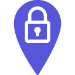

<p align="center">
  <br>
  Keep your location private through obfuscation
</p>

# Lockation

This project has been developed in University context as a proof of concept and illustration for obfuscation techniques over GPS position. As the man in the middle attack, Lockation works by interposing itself between websites and the browser. It acts transparently by adding noise to the GPS positions exchanged.

## Privacy provided

Websites can request an access to your location through browser defined methods. Lockation provides privacy within a defined area by adding noise to your real position, making it less precise. The privacy level defined in options determines the amount of noise added to your real location. A noised position is privacy preserving, however location based services provided by websites would be less useful.

**Note :** Lockation does not cover websites which detect your location based on your IP address, attributed by your Internet Service Provider (ISP).

## Theoretical attacks

|Attack|Description|Protection|Version|
|-|-|:-:|:-:|
|Brute force|Generate too many fake locations which would be centered around the real one. Could be blocked through the cache feature.|✓|0.0.2|
|Knowledge background|External data can be used by malicious websites to guess the real location within the protection area.|✗||

## Permissions

- `geolocation` : Get the real position and add noise over it
- `storage` : Store and retrieve extension settings
- `https://*/*` : Access websites visited and overwrite functions requesting the location

**Note :** Lockation runs locally in the browser and does not send informations to the network.

## Development
> Instructions to install the extension manually

Clone the repository through the following command :

```
git clone https://github.com/Seao/lockation.git
```

On Google Chrome browser, access `chrome://extensions` and enable the `developer mode`. Click the button `load unpacked extension` and select Lockation repository retrieved by the clone command.

Congrats, Lockation is ready for development ! 🎉
